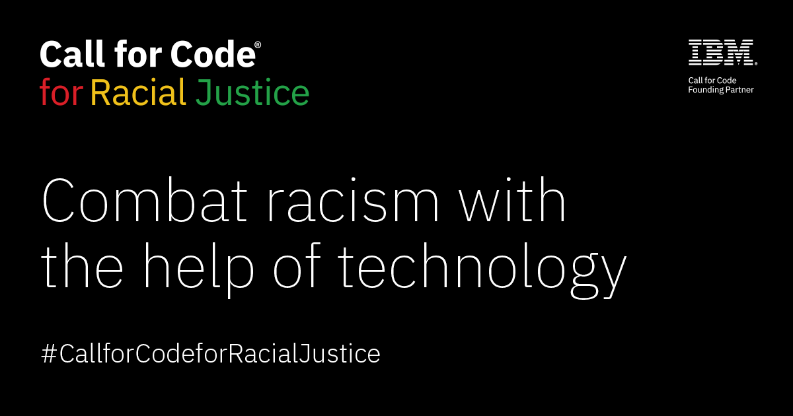

 

# Call for Code for Racial Justice

The main repository for information on Call for Code for Racial Justice projects that are hosted by The Linux Foundation.

## Contributing

Please see [CONTRIBUTING.md](CONTRIBUTING.md) for general project contribution guidelines. Each project may also have its own Technical Steering Committee.

## Projects

* [Open Sentencing](https://github.com/Call-for-Code-for-Racial-Justice/Open-Sentencing)
* [Five Fifths Voter](https://github.com/Call-for-Code-for-Racial-Justice/Five-Fifths-Voter)
* [Incident Accuracy Reporting System](https://github.com/Call-for-Code-for-Racial-Justice/Incident-Accuracy-Reporting-System)
* [Legit Info](https://github.com/Call-for-Code-for-Racial-Justice/Legit-Info)
* [Truth-Loop](https://github.com/Call-for-Code-for-Racial-Justice/Truth-Loop)
* [Fair Change](https://github.com/Call-for-Code-for-Racial-Justice/fairchange)
* [TakeTwo](https://github.com/Call-for-Code-for-Racial-Justice/TakeTwo)

## Links

* [Call for Code for Racial Justice on IBM Developer](https://developer.ibm.com/callforcode/racial-justice/)
* [Call for Code with The Linux Foundation](https://www.linuxfoundation.org/projects/call-for-code/)
* [Other Call for Code open source projects](https://github.com/Call-for-Code)

## License

This project is licensed under the Apache 2 License - see the [LICENSE](LICENSE) file for details. The projects above may be licensed under different licenses. Please see their repos for details.